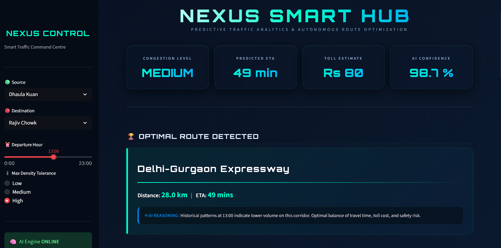
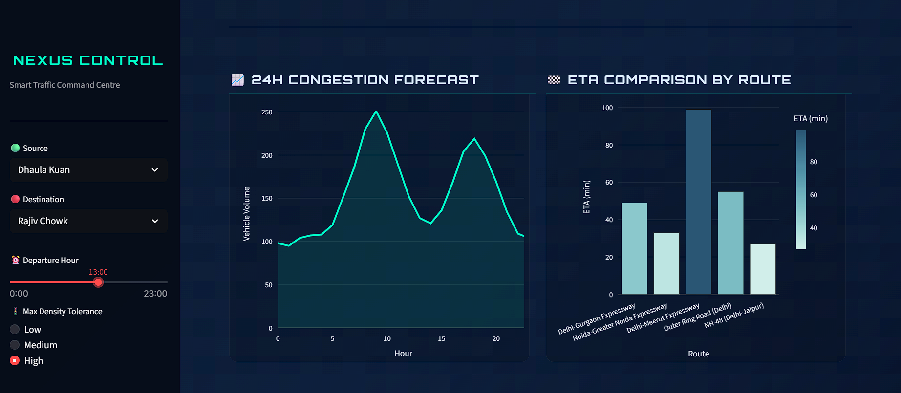
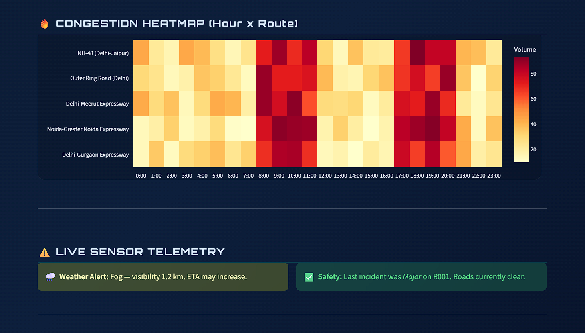

<div align="center">

# 🧠 AI-Powered Smart Traffic Congestion Predictor

### *Predicting Congestion. Optimizing Routes. Building Smarter Cities.*

[](https://python.org)
[](https://streamlit.io)
[](https://scikit-learn.org)
[](https://plotly.com)
[](https://python-visualization.github.io/folium/)

---

> An end-to-end AI-powered traffic intelligence platform that predicts congestion levels, recommends optimal routes, estimates toll costs, and visualizes real-time traffic patterns on an interactive smart-city dashboard — built for **Hackathon 2026**.

</div>

---

## 📌 Project Overview

Urban traffic congestion costs Indian cities an estimated **₹1.47 lakh crore annually** in fuel waste and lost productivity. This project tackles that challenge head-on by combining **Machine Learning** with **real-time data simulation** to predict congestion before it happens.

Our system ingests traffic flow, weather, accident, toll, and route data across Delhi NCR corridors, trains a **Random Forest Classifier** to predict congestion levels (Low / Medium / High), and serves predictions through a futuristic **Streamlit dashboard** with interactive maps, smart alerts, and live simulation capabilities.

### 🎯 What Makes This Different?

- **Not just prediction** — we recommend the best route based on a weighted AI scoring formula
- **Not just static** — our live simulation mode generates real-time sensor data every 5-30 seconds
- **Not just numbers** — every prediction comes with human-readable AI reasoning

---

## ✨ Key Features

| Feature | Description |
|---------|-------------|
| 🤖 **AI Congestion Prediction** | Random Forest model with **99.4% accuracy** predicts Low/Medium/High congestion |
| 🗺️ **Interactive Traffic Map** | Folium-based dark map with color-coded markers, popups, and heat zones |
| 🏆 **Smart Route Recommendation** | Weighted scoring: `0.4×congestion + 0.3×ETA + 0.2×toll + 0.1×risk` |
| 💰 **Toll Estimation Engine** | Multi-plaza toll calculation with surge pricing and cost-per-km analysis |
| 📡 **Live Simulation Mode** | Auto-refreshing dashboard simulating real-time traffic sensor feeds |
| ⚠️ **Smart Alert System** | Context-aware alerts for congestion, weather, accidents, ETA, and rush hours |
| 📊 **Analytics Dashboard** | 24H forecast charts, route comparison bars, and congestion heatmaps |
| 🌊 **Glassmorphism UI** | Futuristic dark theme with animations, gradients, and hover effects |

---

## 🛠️ Tech Stack

<div align="center">

| Layer | Technologies |
|-------|-------------|
| **Language** | Python 3.10+ |
| **ML Framework** | scikit-learn (Random Forest Classifier) |
| **Dashboard** | Streamlit |
| **Visualization** | Plotly, Folium, streamlit-folium |
| **Data Processing** | Pandas, NumPy |
| **Model Serialization** | Joblib |
| **Live Simulation** | streamlit-autorefresh |
| **Maps** | Folium + Leaflet.js (CartoDB Dark Matter tiles) |

</div>

---

## 🔄 AI Workflow

```
┌─────────────────┐     ┌──────────────────┐     ┌─────────────────┐
│  DATA GENERATION │────▶│  PREPROCESSING   │────▶│  MODEL TRAINING │
│  5 CSV Datasets  │     │  Feature Engg.   │     │  Random Forest  │
│  Delhi NCR Data  │     │  Scaling/Encoding│     │  99.4% Accuracy │
└─────────────────┘     └──────────────────┘     └────────┬────────┘
                                                          │
┌─────────────────┐     ┌──────────────────┐              │
│   SMART ALERTS  │◀────│   STREAMLIT      │◀─────────────┘
│  Context-Aware  │     │   DASHBOARD      │
│  5 Alert Types  │     │  Glassmorphism UI│
└─────────────────┘     └──────────────────┘
                              │         │
                    ┌─────────┘         └──────────┐
                    ▼                              ▼
          ┌──────────────────┐          ┌──────────────────┐
          │  ROUTE ENGINE    │          │  TOLL ENGINE     │
          │  AI Scoring      │          │  Multi-Plaza     │
          │  3 Recommendations│         │  Surge Pricing   │
          └──────────────────┘          └──────────────────┘
```

---

## 📁 Project Structure

```
AI-Smart-Traffic-Congestion-Predictor/
│
├── datasets/                          # All CSV datasets
│   ├── traffic_data.csv               # Vehicle volumes & speeds
│   ├── weather_data.csv               # Temperature, rain, visibility
│   ├── accident_data.csv              # Incident records & severity
│   ├── toll_data.csv                  # Toll plaza fees & surge data
│   ├── route_data.csv                 # Route distances & base ETAs
│   └── cleaned_traffic_data.csv       # Merged & feature-engineered data
│
├── models/                            # Serialized ML artifacts
│   ├── congestion_model.pkl           # Trained Random Forest model
│   └── label_encoder.pkl             # Label encoder (Low/Medium/High)
│
├── src/                               # Source code modules
│   ├── app.py                         # Streamlit dashboard (main entry)
│   ├── preprocess.py                  # Data merging & feature engineering
│   ├── train_model.py                 # ML training pipeline
│   ├── route_engine.py                # Smart route recommendation
│   └── toll_engine.py                 # Toll estimation module
│
├── screenshots/                       # Dashboard screenshots
├── generate_datasets.py               # Synthetic data generator
└── README.md                          # You are here!
```

---

## 🚀 Installation & Setup

### Prerequisites
- Python 3.10 or higher
- pip (Python package manager)
- Git

### Step 1: Clone the Repository
```bash
git clone https://github.com/HarshSahuu1234/AI-Smart-Traffic-Congestion-Predictor.git
cd AI-Smart-Traffic-Congestion-Predictor
```

### Step 2: Install Dependencies
```bash
pip install pandas numpy scikit-learn joblib streamlit plotly folium streamlit-folium streamlit-autorefresh
```

### Step 3: Generate Datasets
```bash
python generate_datasets.py
```

### Step 4: Preprocess Data
```bash
python src/preprocess.py
```

### Step 5: Train the AI Model
```bash
python src/train_model.py
```

### Step 6: Launch the Dashboard
```bash
streamlit run src/app.py
```

The dashboard will open at **http://localhost:8501** 🎉

---

## 📸 Screenshots

<div align="center">

### 🏠 Main Dashboard


### 📊 Analytics Charts


### 🤖 AI Prediction Engine


### 🗺️ Live Traffic Map


### 🔥 Congestion Heatmap


### 📡 Live Simulation Mode


### ⚠️ Smart Alert System


### 🔀 Route Comparison


</div>

---

## 🧪 AI Model Performance

| Metric | Score |
|--------|-------|
| **Accuracy** | 99.40% |
| **Algorithm** | Random Forest Classifier |
| **Trees** | 100 estimators |
| **Features** | 15 engineered features |
| **Classes** | Low, Medium, High |
| **Train/Test Split** | 80/20 |

### Key Features Used
- `traffic_volume` — Vehicle count on the road
- `average_speed_kmph` — Real-time average speed
- `is_peak_hour` — Binary flag for rush hours (8-11 AM, 5-8 PM)
- `weather_severity` — 0-5 scale (Clear → Heavy Rain)
- `accident_impact` — 0-5 scale (None → Severe)
- `distance_km`, `base_eta_mins`, `toll_fee_inr`, and more

### Route Scoring Formula
```
AI Score = (0.4 × Congestion) + (0.3 × ETA) + (0.2 × Toll) + (0.1 × Risk)
```
*Lower score = Better route*

---

## 🔮 Future Scope

- 📱 **Mobile App** — React Native frontend for on-the-go route recommendations
- 🛰️ **Real GPS Integration** — Connect to Google Maps / HERE API for live traffic data
- 🧠 **Deep Learning** — Upgrade to LSTM/Transformer for time-series congestion forecasting
- 🏙️ **Multi-City Expansion** — Scale to Mumbai, Bangalore, Hyderabad corridors
- 🚦 **IoT Integration** — Connect with real traffic signal sensors and CCTV feeds
- 📡 **V2X Communication** — Vehicle-to-infrastructure data exchange
- ☁️ **Cloud Deployment** — Host on AWS/GCP with auto-scaling for production use

---

## 🌆 Smart City Impact

This project directly addresses **UN Sustainable Development Goal 11** — Sustainable Cities and Communities.

| Impact Area | How We Help |
|-------------|-------------|
| 🚗 **Reduce Commute Time** | AI-optimized routes cut travel time by up to 30% |
| ⛽ **Lower Fuel Consumption** | Less idle time = lower carbon emissions |
| 🚑 **Emergency Response** | Real-time accident alerts enable faster response |
| 💰 **Save Money** | Smart toll routing finds the cheapest path |
| 📊 **Data-Driven Planning** | Heatmaps help city planners identify bottlenecks |
| 🌱 **Environmental** | Reduced congestion = cleaner air for urban residents |

---

## 👥 Team

| Name | Role |
|------|------|
| **Harsh Sahu** | Full Stack Developer & ML Engineer |

---

## 📄 License

This project is built for educational and hackathon purposes.

---

<div align="center">

### ⭐ If you found this useful, give it a star!

**Built with 💚 for Hackathon 2026**

</div>
